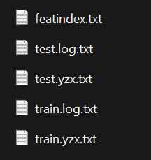

# Steps to create the iPinYou dataset:

1. Download the raw data from the [Kaggle mirror](https://www.kaggle.com/datasets/lastsummer/ipinyou) since the original links are dead. This step may take time, since the data is ~6 GB in size.
2. Move the `ipinyou.contest.dataset` folder into `make-ipinyou-data/original-data`.
3. Run 

```
cd make-ipinyou-data && ln -s ./ipinyou.contest.dataset/ original-data/ipinyou.contest.dataset
```

4. Run `./run_pipeline.sh` in the root to obtain campaign-wise data folders. This step takes time since it uses heavy disk operations. In all, the uncompressed data occupies ~14 GB. 

The campaign-wise data must contain five files like this:

 

You can now move to the `optimal-rtb` folder for running CTR experiments. We have run experiments for campaign 1458.